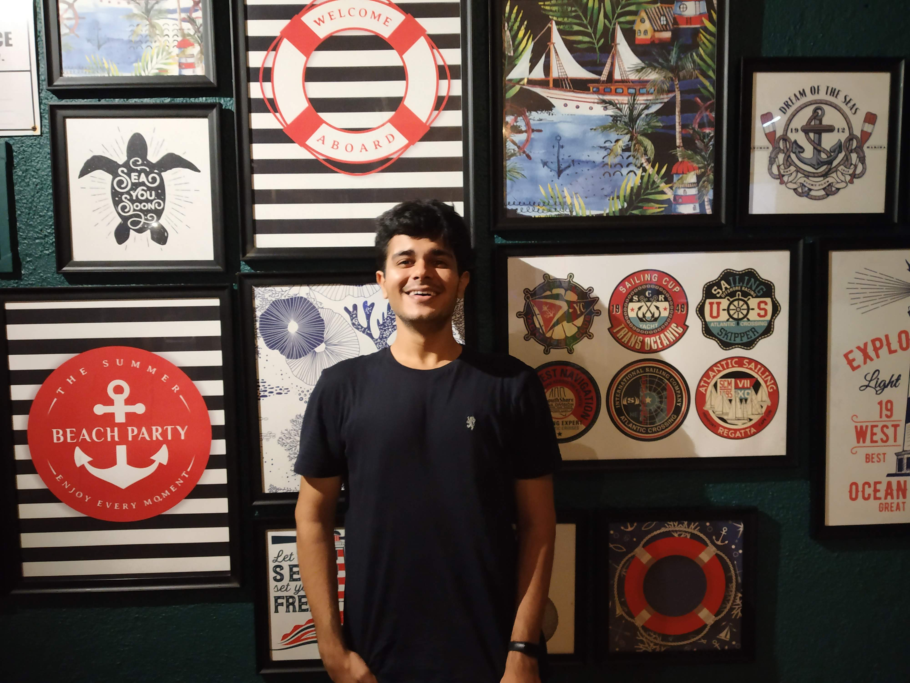

    

      
    

    

        <!--   -->
        <ul class="affiliations">
          <li>
            Application Developer 
            Oracle 
            Hyderabad, India
          </li>
        </ul>

    

****

## Bio ##
Information about me. Coming Soon!

*****
## Projects ##

  
    <article class="post">

      <h3><a href="{{ site.baseurl }}{{ project.url }}">{{ project.title }}</a></h3>

      

        {{ project.content }}
      

      <!-- <a href="{{ site.baseurl }}{{ project.url }}" class="read-more">Read More</a> -->
    </article>
  

