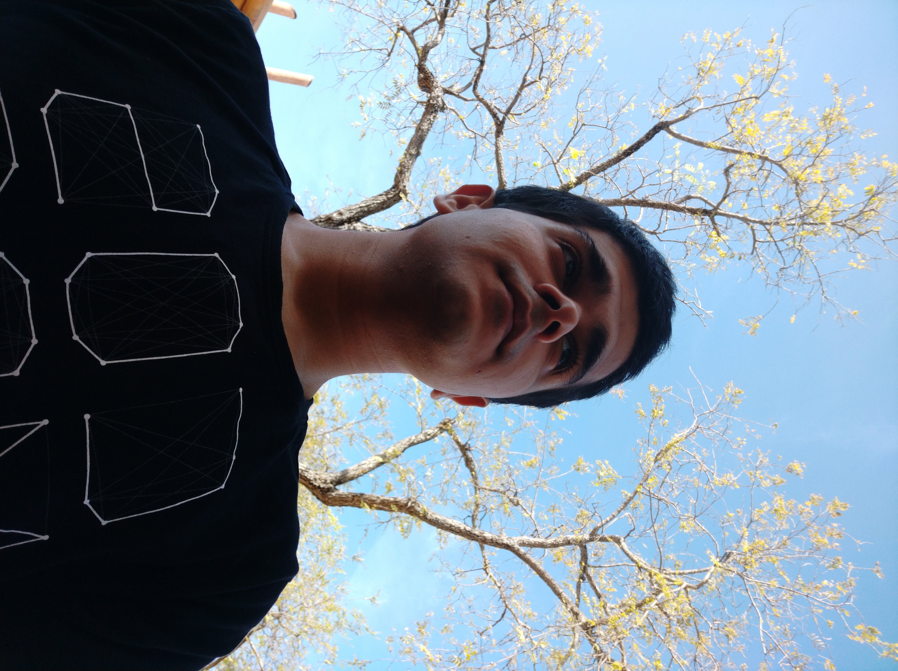

    

      
    

      

          <ul class="affiliations">
            

            <li>
                

                
                

                {{ affiliation.role }} 
                {{ affiliation.organization }} 
                {{ affiliation.location }}

            </li>
           
          </ul>
      

****

## Bio ##
Hello there! I am Gunjan Chhablani, a recently graduated undergrad from [BITS Pilani Goa](https://bits-pilani.ac.in/), with a B.E. in Computer Science. I am currently working as an Applications Engineer at [Oracle, India](https://www.oracle.com/in/index.html) where I work on developing web applications for Oracle employees. Apart from that, I am highly interested in deep learning and its applications and use my personal time to work on research projects. My broad research interests include - computer vision, biomedical image analysis, natural language processing, and multi-modal learning.  Prior to this, I spend a wonderful semester at [University of Pittsburgh, Medical Center](https://www.upmc.com/) for my undergraduate thesis where I was advised by [Dr. Kunal Dansingani](http://ophthalmology.pitt.edu/people/kunal-k-dansingani-mbbs-ma-frcophth) and [Dr. Shan Suthaharan](https://sites.google.com/uncg.edu/shan-suthaharan/home?authuser=0). My work was focussed on analysing a novel weight initialization technique and its performance on choroid segmentation in OCT Scans.

*****

## News ##
Hoping to add some good stuff here soon!

*****
## Projects ##

  
    <article class="post">
    <h3><a href="{{ site.baseurl }}{{ project.url }}">{{ project.title }}</a></h3>

    

      
      
        <i> Mentor(s):
          
          <a href = "{{ mentor.link }}">{{ mentor.name }}</a>,
          
        </i>
      

      
      
          <i> Domain(s):
            
            {{ domain }}
              , 
            
          </i>

      
    

    
       <a class="code" href="{{ project.codelink }}"> Code </a>
    

    
    <figure>
      
      <figcaption>{{ project.caption }}</figcaption>
    </figure>
    

    

      {{ project.content }}
    

      <!-- <a href="{{ site.baseurl }}{{ project.url }}" class="read-more">Read More</a> -->
    </article>
  

